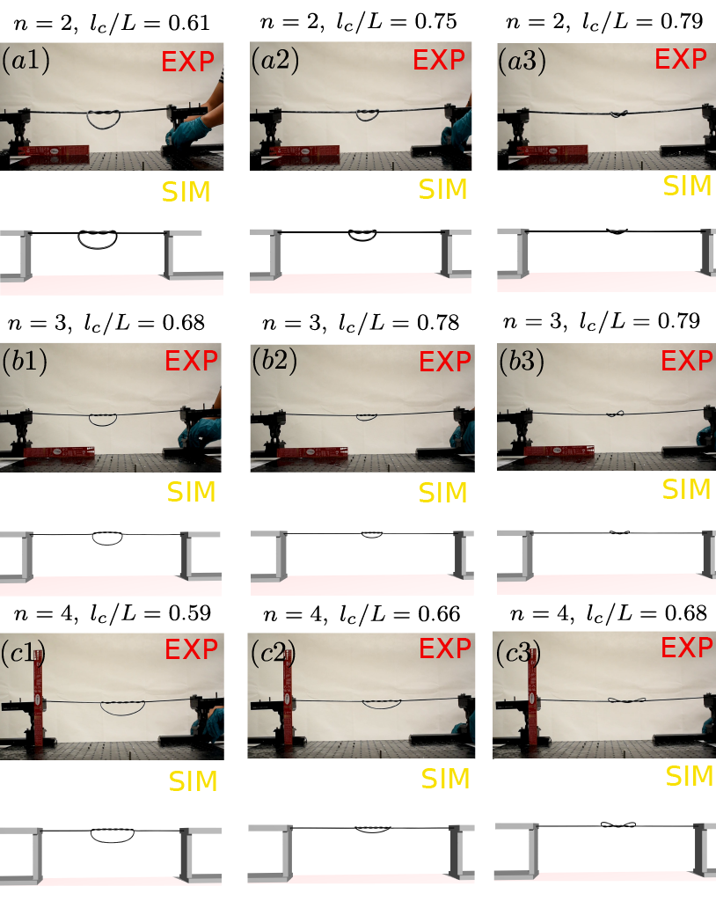

## [Snap Buckling in Overhand Knots](https://asmedigitalcollection.asme.org/appliedmechanics/article-abstract/doi/10.1115/1.4056478/1154422/Snap-Buckling-in-Overhand-Knots)

This work studies the snap buckling process when tightening an over hand knot. Uses [Discrete Elastic Rod (DER)](http://www.cs.columbia.edu/cg/pdfs/143-rods.pdf) framework and incorporates contact and friction. Comparison between simulations and experiments is seen below in Figure 1.

<p align="center">

<br>
<em> Figure 1. Comparison between simulations and experiments for different overhand knots. </em>
</p>


## How to Use
The codes are developed under linux systems. Please use the codes in linux systems.

### Dependencies
Install the following C++ dependencies:
- [Eigen](http://eigen.tuxfamily.org/index.php?title=Main_Page)
  - Eigen is used for various linear algebra operations.
  - Simulation codes is built with Eigen version 3.4.0 which can be downloaded [here](https://gitlab.com/libeigen/eigen/-/releases/3.4.0). After downloading the source code, install through cmake as follows.
    ```bash
    cd eigen-3.4.0 && mkdir build && cd build
    cmake ..
    sudo make install
    ```
- [Intel oneAPI Math Kernel Library (oneMKL)](https://www.intel.com/content/www/us/en/developer/tools/oneapi/onemkl-download.html?operatingsystem=linux&distributions=webdownload&options=online)
    - Necessary for access to Pardiso, which is used as a sparse matrix solver.
    - Intel MKL is also used as the BLAS / LAPACK backend for Eigen.
    - If you are using Linux, follow the below steps. Otherwise, click the link above for your OS.
      ```bash
      cd /tmp
      wget https://registrationcenter-download.intel.com/akdlm/irc_nas/18483/l_onemkl_p_2022.0.2.136.sh
      
      # This runs an installer, simply follow the instructions.
      sudo sh ./l_onemkl_p_2022.0.2.136.sh
      ```
    - Add the following to your .bashrc. Change the directory accordingly if your MKL version is different.
      ```bash
      export MKLROOT=/opt/intel/oneapi/mkl/2022.0.2
      ```


- [OpenGL / GLUT](https://www.opengl.org/)
  - OpenGL / GLUT is used for rendering the knot through a simple graphic.
  - Simply install through apt package manager:
      ```bash
    sudo apt-get install libglu1-mesa-dev freeglut3-dev mesa-common-dev
    ```
- Lapack (*usually preinstalled on your computer*)

***
### Compiling
After completing all the necessary above steps, clone the source repository of IMC and then build the project through cmake.
```bash
mkdir build && cd build
cmake ..
make -j4
```

***

### Setting Parameters

All simulation parameters are set through a parameter file ```option.txt```. A template file ```option.txt``` is provided that can be used to construct customized ```option.txt```.

Specifiable parameters are as follows (we use SI units):
- ```RodLength``` - Contour length of the rod.
- ```numVertices``` - Number of nodes on the rod.
- ```rodRadius``` - Cross-sectional radius of the rod.
- ```density``` - Mass per unit volume.
- ```youngM``` - Young's modulus.
- ```Poisson``` - Poisson ratio.
- ```tol``` and ```stol``` - Small numbers used in solving the linear system. Fraction of a percent, e.g. 1.0e-3, is often a good choice.
- ```maxIter``` - Maximum number of iterations allowed before the solver quits. 
- ```gVector``` - 3x1 vector specifying acceleration due to gravity.
- ```viscosity``` - Viscosity for applying damping forces.
- ```render (0 or 1) ```- Flag indicating whether OpenGL visualization should be rendered.
- ```saveData (0 or 1)``` - Flag indicating whether pull forces and rod end positions should be reocrded.
- ```dataResolution``` - Rate of data recording in seconds. Applies to both ```saveData``` and ```recordNodes```.
- ```statictime``` Initial wait period duration.
- ```pullTime``` - Duration to pull for (*starts after ```waitTime``` is done*).
- ```pullSpeed``` - Speed at which to pull and/or loosen each end.
- ```deltaTime``` - Time step size.
- ```filename``` - File name for the initial knot configuration. Should be a txt file located in ```knot_configurations``` directory. Note that overhand knot configurations for ```n1, n2, n3, n4``` are provided with a discretization of 301 nodes.

***
### Running the Simulation
Once parameters are set to your liking, the simulation can be ran from the terminal by running the provided script:
```bash
./run.sh
```
If this doesn't work, execute ```chmod +x run.sh``` prior to running.

***

### Citation
If our work has helped your research, please cite the following paper.
```

@article{10.1115/1.4056478,
    author = {Tong, Dezhong and Choi, Andrew and Joo, Jungseock and Borum, Andy and Khalid Jawed, Mohammad},
    title = "{Snap Buckling in Overhand Knots}",
    journal = {Journal of Applied Mechanics},
    volume = {90},
    number = {4},
    pages = {041008},
    year = {2023},
    month = {01},
    issn = {0021-8936},
    doi = {10.1115/1.4056478},
    url = {https://doi.org/10.1115/1.4056478},
    eprint = {https://asmedigitalcollection.asme.org/appliedmechanics/article-pdf/90/4/041008/6975362/jam\_90\_4\_041008.pdf},
}


```
